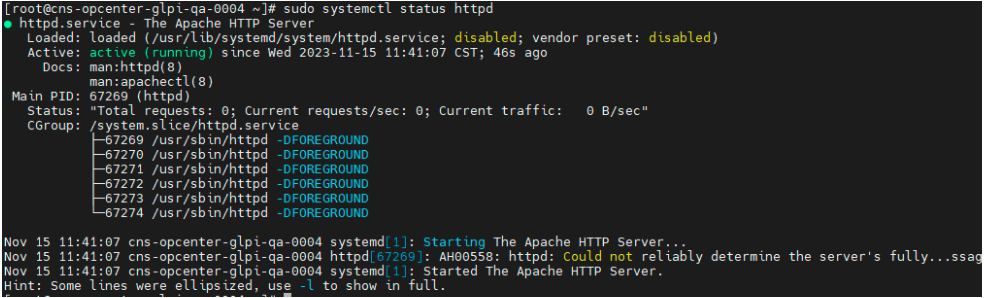
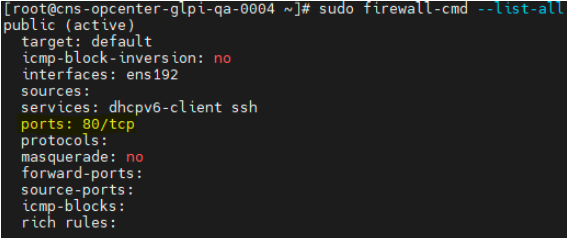
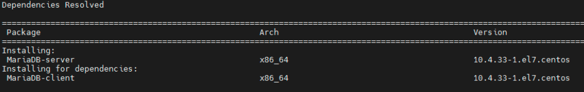
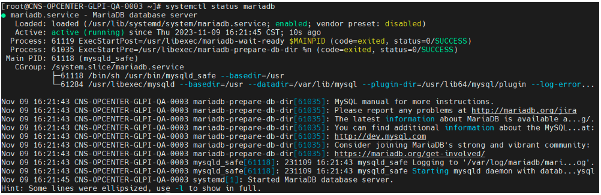
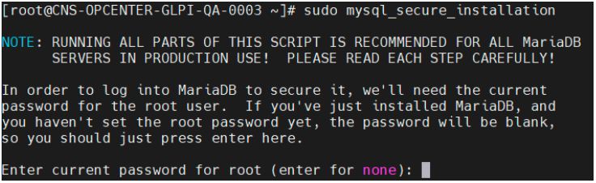
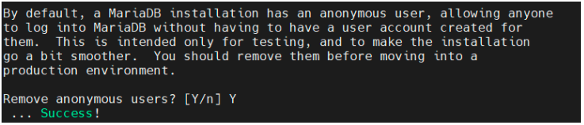
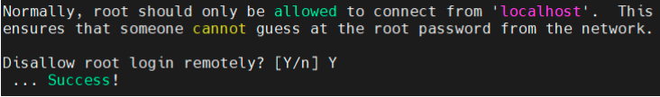
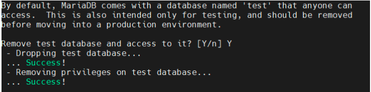
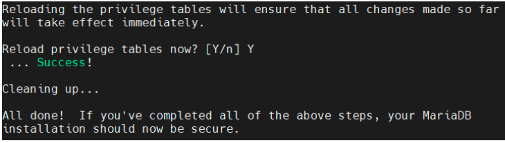

# Instalación de GLPI 10.0.X
### ¿Que es GLPI?
GLPI es una aplicación de código abierto que se utiliza para gestionar activos de TI (Tecnologías de la Información) y proporcionar soluciones de gestión de servicios de TI (ITSM, por sus siglas en inglés). El nombre GLPI proviene de "Gestionnaire Libre de Parc Informatique," que en francés significa "Gestión Libre de Parque Informático."

### Requsitos
- 2 servidores web con las siguientes características:
- - Capacidad de 4 CPU’s
- - 8GB de RAM
- - 100GB Servidor APP
- - 500GB Servidor BD (Varia durante la cantidad de información que se vaya almacenando en la Base de Datos.

- Sistema Operativo Linux (recomendado): 
- - Distribuciones como CentOS, Ubuntu, Debian, openSUSE, o cualquier otra distribución Linux compatible suelen ser opciones comunes para ejecutar GLPI.
- - Windows: También es posible ejecutar GLPI en un servidor con Windows, pero es menos común.

- Servidor Web:
- - Apache: Es el servidor web más utilizado con GLPI.
- - NGINX: También es una opción viable.

- Servidor Base de Datos:
- - MySQL: Esta es la base de datos recomendada.
- - MariaDB: Otra alternativa compatible con MySQL. (Recomendable)
- - PostgreSQL: Puede ser utilizado, pero es menos común.

- Lenguaje de Programación:
- - PHP: GLPI está escrito en PHP. Necesitarás una versión compatible de PHP (por ejemplo, PHP 7.3 a 8.2).

🚨 NOTA: La versión de PHP debe ser instalada dentro del rango 7.4.0 a 8.2.0, si la versión supera o es baja a este rango, GLPI no funcionará

# Proceso de Instlación GLPI

## Servidor 1 (APP)
### Instalación de Apache
 Para proceder con la instalación se actualice el httpd índice del paquete Apache local para reflejar los últimos cambios ascendentes:

> sudo yum update httpd

Una vez actualizado el paquete se procede con la instalación:

> sudo yum install httpd

Apache no se inicia automáticamente en CentOS una vez que se completa la instalación. Deberá iniciar el proceso de Apache manualmente

> sudo systemctl start httpd

Se verifica es estatus con:

> sudo systemctl status httpd

 

Adicionalmente habilitamos el puerto 80 para que funcione apache

>sudo firewall-cmd --zone=public --add-port=80/tcp --permanent

>sudo firewall-cmd –reload

Verificamos con:

>sudo firewall-cmd --list-all

### Instalación de PHP

Hay que saber que los repositorios oficiales de CentOS 7 sólo ofrecen hasta la versión de PHP 5.4.16, que es una versión obsoleta e insegura, por lo que debemos realizar los siguientes pasos para proceder con la última versión.

Antes debemos agregar el repositorio.

> sudo yum install -y http://rpms.remirepo.net/enterprise/remi-release-7.rpm

Procedemos a instalar las herramientas de yum para configurar el nuevo repo

>sudo yum install -y yum-utils

Ahora configuramos el repositorio para especificar la versión de PHP 8.2 que nos interesa. 

>sudo yum-config-manager --enable remi-php82

Por último, para finalizar el agregado del repositorio, basta con actualizar la información de los repositorios

>sudo yum update -y

Ahora se procede con la instalación 

>sudo yum install php

>sudo yum install php-{gd,imap,intl,ldap,mbstring,opcache,pear-CAS,pecl-apcu,xmlrpc,pecl-zip, mysql}

Con esto queda instalado más sin embargo, los cambios no tendrán efecto en el servidor web hasta que lo reiniciemos. Por lo que se procede a reiniciar el servicio

>sudo systemctl restart httpd

Ahora ya que se cuenta con los requisitos básicos se puede proceder con la instalación de GLPI para el servidor 1 (APP)

## Servidor 2 (Base de Datos)
### Instalación de MariaDB
Debemos tener en cuenta que la versión presente en los repositorios es la última versión.

Para instalarla bastará con usar el gestor de paquetes yum para instalar los paquetes necesarios, por lo que la primera acción será actualizar el sistema:

>sudo yum update

Ya podemos instalar el paquete mariadb-server, cuyas dependencias instalarán también el cliente de consola mysql:

>sudo yum install -y mariadb-server

El gestor yum agregara el cliente de forma automática la dependencia faltante si lo instala por medio de RPM hay que instalar los 2

Sin embargo, se puede instalar cualquier otra versión, solo hay que añadir un nuevo repositorio para yum. Como ejemplo instalaremos MariaDB 10.0, seguiremos los siguientes pasos:

- Accedemos al archivo mariadb.repo:

> sudo vi /etc/yum.repos.d/MariaDB.repo

El contenido de este archivo será el siguiente:

>[mariadb]
 name = MariaDB
 baseurl = http://yum.mariadb.org/10.5/centos7-amd64
gpgkey=https://yum.mariadb.org/RPM-GPG-KEY-MariaDB
gpgcheck=1

Guardamos los cambios y actualizamos las listas de paquetes:

> sudo yum clean all

Se finaliza con el:

>sudo yum install -y MariaDB-server

🚨 NOTA: la versión de maríaDB varía dependiendo la versión de GLPI, lo recomendable es instalar las versiones estables sugeridas.

### Configuración de arranque del servicio automático e iniciar la Dase de Datos

Sea cual sea la versión de MariaDB Server que instales en CentOS 7, al final del proceso se creará un nuevo servicio en el sistema, mariadb.service o simplemente mariadb.

Si queremos que el servicio MariaDB arranque en cada inicio del sistema, lo tendremos que habilitar con el comando systemctl:

> sudo systemctl enable mariadb

Se arrancar el servicio:

> sudo systemctl start mariadb

Ahora verificamos el estatus del proceso:

> systemctl status mariadb

### Configuración inicial de la base de datos

Antes de empezar a trabajar con el servicio de base de datos conviene ejecutar el script mysql_secure_installation que se encargará de dejar nuestra instalación más segura que con la configuración que viene por 
defecto:

> sudo mysql_secure_installation

Presionamos “enter” y nos preguntara si deseamos ingresar un pass (Si la contraseña de root está en blanco nos da la oportunidad de establecerla).

Una vez ingresado el nuevo pass nos pregunta si quitamos los usuarios anónimos

Configurar el acceso de root como exclusivamente local, impidiendo que se conecte remotamente (también muy importante, para evitar ataques).

Eliminar la base de datos ‘test‘, que está pensada para hacer pruebas.

Finalmente, que todos estos cambios entren en vigor de inmediato.

### Creación de usuario y base de datos
Se procede a crear la Base de datos que se usara:

> CREATE DATABASE IF NOT EXISTS `db_glpi`;

Se necesita crear un usuario para la base el cual se usará para que GLPI pueda conectarse:

> CREATE USER 'glpi'@'%' IDENTIFIED BY ' TuClaveAqui ';

Se otorga al usuario el permiso mínimo para conectarse y establece una contraseña:

> GRANT USAGE ON *.* TO 'glpi'@'%' IDENTIFIED BY 'TuClaveAqui';

Se otorga al usuario todos los privilegios a todas las tablas.

>GRANT ALL PRIVILEGES ON *.* TO 'glpi'@'%';

Se procede a recargar los privilegios dados anteriormente:

> FLUSH PRIVILEGES;

### Juego de caracteres por defecto de MariaDB

El juego de caracteres por defecto al instalar MariaDB se configura como latin1, cuando lo correcto para idioma español sería al menos utf8 o, mejor aún, utf8mb4. Para modificar esto editamos el archivo de configuración de 
MariaDB:

> sudo vi /etc/my.cnf.d/server.cnf

Y en la sección mysqld añadimos estas dos líneas:
> ...
 [mysqld]
 ...
 character_set_server=utf8mb4
 collation_server=utf8mb4_unicode_ci
 ...

Guardamos los cambios y reiniciamos el servicio:

> sudo systemctl restart mariadb

## Descargar GLPI

🚨 N O T A: para este proceso estaremos en el servidor 1 (APP)

Para esta instalación se procederá con la versión 10.0.5, por lo que nos vamos al repositorio:

> https://github.com/glpi-project/glpi/releases

Y elegimos la versión deseada.

En el servidor procedemos con la descarga del archivo

> wget https://github.com/glpi-project/glpi/releases/download/10.0.5/glpi-10.0.5.tgz

Una vez descargado procedemos con descomprimirlo y nos extraerá la carpeta ‘glpi’ y habrá que mover a la ruta “/var/www/html/”

> tar -zxvf glpi-10.0.5.tgz -C /var/www/html/

Otorgamos permisos para apache sobre la ruta anterior y modificamos sus permisos

> chown -R apache. /var/www/html/

> chmod -R 755 /var/www/html/glpi/

Ahora ya se podría proceder con la instalación grafica de GLPI, por lo que nos podemos dirigir a la siguiente ruta ( Donde la IP_SERVER es la ip donde está instalado).

> http://IP_SERVER/glpi/install/install.php
