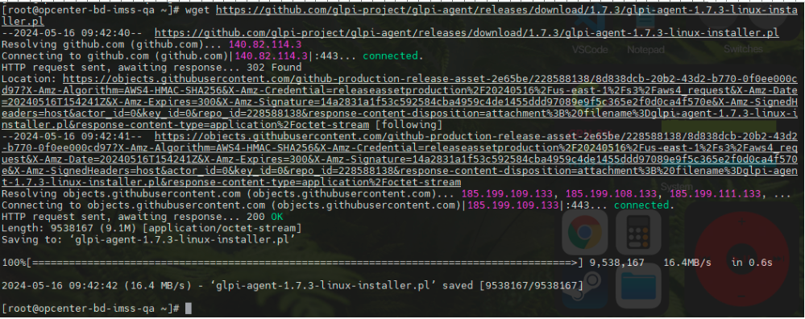
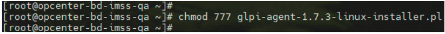
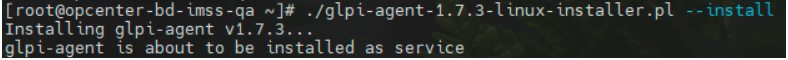
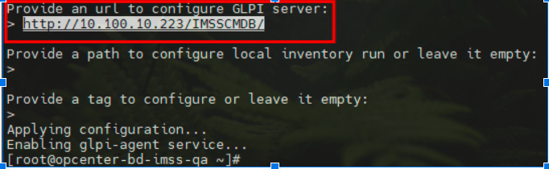

# Instalación de agente en CentOS 7
## Descarga del agente
Para descargar el agente de glpi en el sistema operativo de CentOS 7 primero aplicaremos el siguiente comando para comenzar la descarga de la misma, en este caso vamos a descargar la versión del agente 1.7.3

> wget https://github.com/glpi-project/glpi-agent/releases/download/1.7.3/glpi-agent-1.7.3-linux-installer.pl

Se estará ejecutando la descarga del agente, una vez que esta finalice podemos ejecutar un ls -la para visualizar que el archivo se haya descargado correctamente.

## Instalación del agente
Una vez ya teniendo el agente descargado, le concedemos todos los permisos al archivo del agente con el siguiente comando:

> chmod 777 glpi-agent-1.7.3-linux-installer.pl

Ejecutaremos el comando para correr el agente: 

> ./glpi-agent-1.7.3-linux-installer.pl --install

Esperamos a que el comando nos arroje la primera parte de la instalación del agente, en esta primera parte estaremos metiendo la ruta del servidor del glpi.

> http://10.100.10.223/IMSSCMDB/

Una vez que hayamos insertado la ruta del agente se le estará dando “enter” 3 veces para empezar la ejecución del agente y que se vincule con el glpi. El tiempo de espera para que se vea reflejado en GLPI tarda de entre los primeros 5min a 3 horas.

