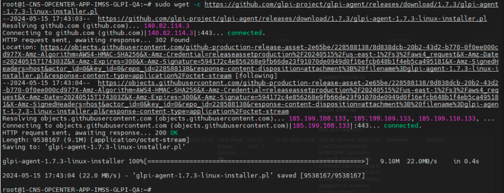
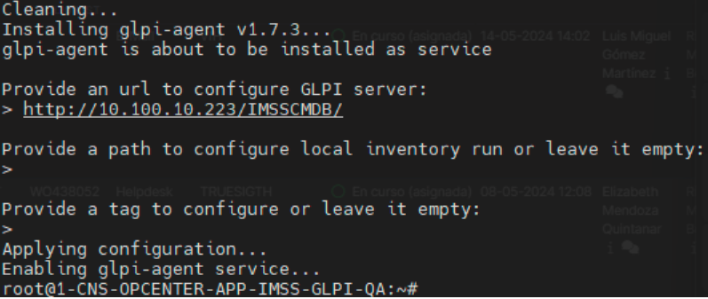
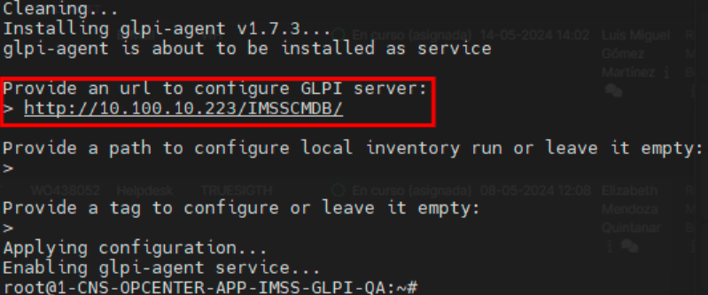
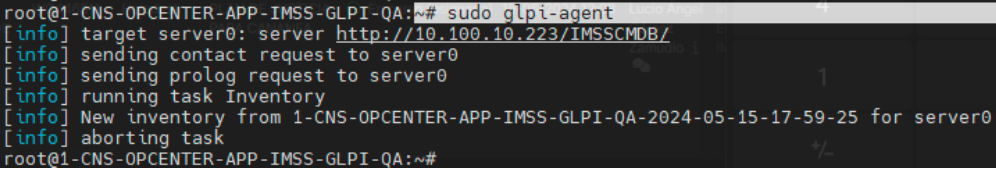
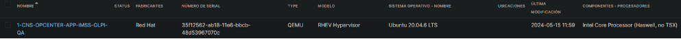

# Intalación de agente en Ububtu
## Descarga del agente
Ingresamos al servidor en el que se va realizar la instalación del agente y ejecutamos el siguiente comando.

> sudo wget -c https://github.com/glpi-project/glpi-agent/releases/download/1.7.3/glpi-agent-1.7.3-linux-installer.pl

una vez ejecutado se realizará la descarga del agente:

## Instalación del agente
Una vez descargado el agente primero le consideremos permisos al mismo:

> chmod 777 glpi-agent-1.7.3-linux-installer.pl

Una vez concedido los permisos al agente ejecutaremos el siguiente comando:

> ./glpi-agent-1.7.3-linux-installer.pl --install

Esperamos a que el comando mande la siguiente información:

En la primera línea de estará metiendo la liga del servidor donde está el GLPI a apuntar:

En este caso se estará usando la siguiente liga “http://10.100.10.223/IMSSCMDB/”, una vez establecida la liga se estará dando enter 3 veces.

Para comprobar que el Agente está corriendo y ejecutándose correctamente ejecutaremos el siguiente comando:

> sudo glpi-agent

Nos arrojará la información del agente instalado:

Esto indicará que el agente está haciendo conexión con el glpi correctamente.

