# Instalación de agente en Windows Server 2008

## Descarga del agente

Antes de iniciar con la descarga del agente tenemos que saber la arquitectura del sistema operativo de la computadora, en este caso la computadora en la cual se va estar instalando es una de 64 bits.

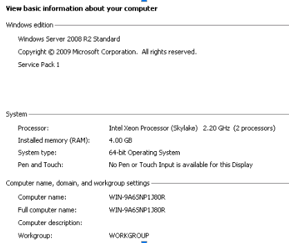

En el siguiente enlace nos llevará a la página donde se puede descargar el agente de glpi para los diferentes sistemas operativos y versiones del mismo agente, en este caso vamos a descargar la última versión del agente para el sistema operativo de Windows

> https://github.com/glpi-project/glpi-agent/releases

Una vez descargado, nos aventara un archivo de instalación .msi

## Instalación del agente

Comenzando con la instalación del agente, se le estará dando clic derecho sobre el instalador y le damos clic en instalar.

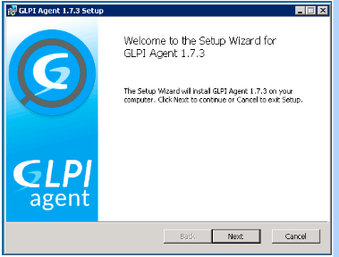

Nos abrirá la siguiente ventana, le damos clic en “Next”

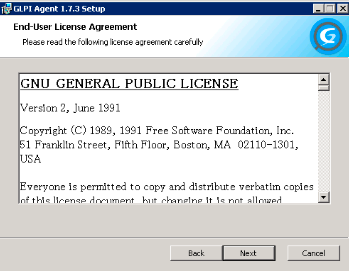

damos clic en “Next”, aceptando los términos y condiciones del agente instalador:

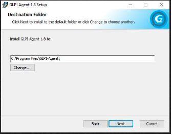

Damos clic en “Next”

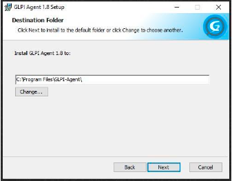

Seleccionamos la opción de “Typical” y le damos clic en “Next”

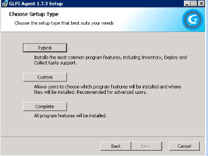

En esta parte vamos a insertar la ruta del agente, para este ejemplo usaremos la siguiente ruta  “http://10.100.10.223/IMSSCMDB/” y le damos clic en “Next”

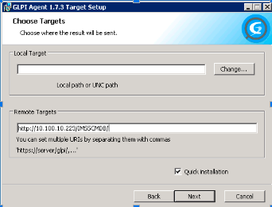

Le damos clic en “Install” 

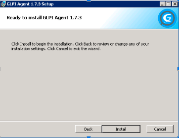

Se comenzará la instalación del agente, esto puede demorar de entre 5 a 10 minutos.

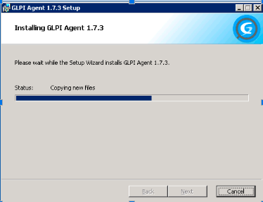

Una vez finalizada la instalación mostrará la siguiente ventana, le daremos clic en “Finish”

Para comprobar que la instalación del agente fue correcta nos vamos a disco local C y seleccionamos la carpeta “Archivos de Programa”

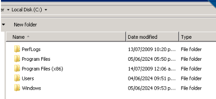

Abrimos  la carpeta “GLPI-Agent”

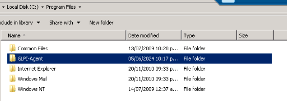

Abrimos la carpeta “logs”

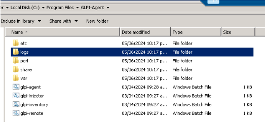

Abrimos el archivo “glpi-agent.log”

Nos abrirá el siguiente bloc de notas con las especificaciones de uq ele agente está corriendo correctamente y está establecida la conexión con el glpi.

 

Nos dirigimos al inventario de GLPI y podremos observar que la máquina ya se encuentra registrada.

