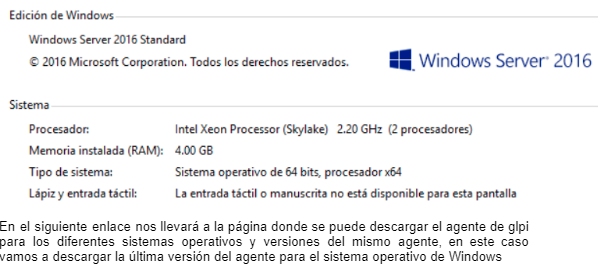

# Instalación de agente en Windows Server 2016
## Descarga del agente
Antes de iniciar con la descarga del agente tenemos que saber la arquitectura del sistema operativo de la computadora, en este caso la computadora en la cual se va estar instalando es una de 64 bits.

