# Instalación de agente en Windows XP

## Descarga del agente

Para la descarga del agente para el sistema operativo de Windows XP, se estará descargando la versión del agente 1.0, en arquitectura de 32 bits.

> https://github.com/glpi-project/glpi-agent/releases/download/1.0/GLPI-Agent-1.0-x86.msi

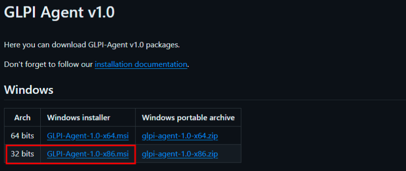

Como se ve en la imagen se estará descargando el .msi, para que este sea compatible con la versión del sistema operativo.

## Instalación del agente

Se pasa el instalador al escritorio, para una mejor ubicación del instalador

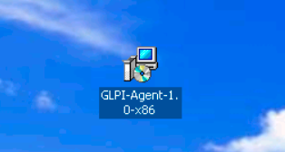

Dar clic derecho sobre el instalador y después clic en “Instalar”

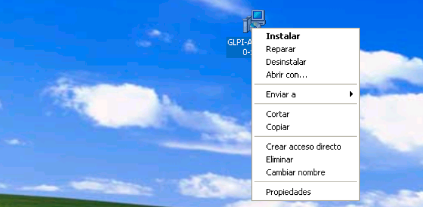

Dar clic en “next”

Clic en “Next”

Dar clic en “Next”

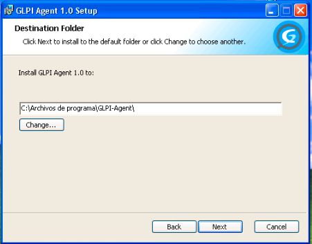

Seleccionar “Typical” y luego clic en “Next”

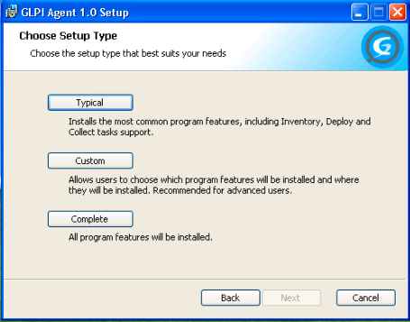

En esta parte pondremos la dirección del servidor del glpi al cual se va estar vinculando en la parte de “Remote Targets”, después dar clic en “Next”

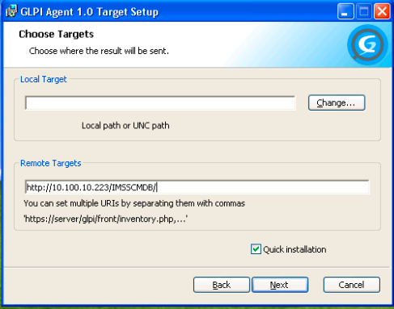

Dar clic en “Install”

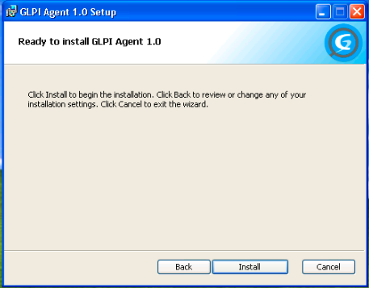

Esperar a que la instalación se complete

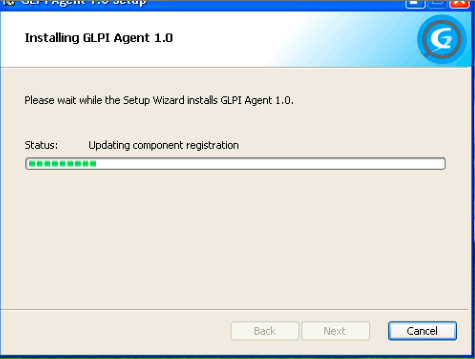

Una vez que termine la instalación, dar clic en “Finish”

## Comprobación de instalación del agente 

Una vez que termine la instalación se dirige al menú de inicio y en “Mi PC”

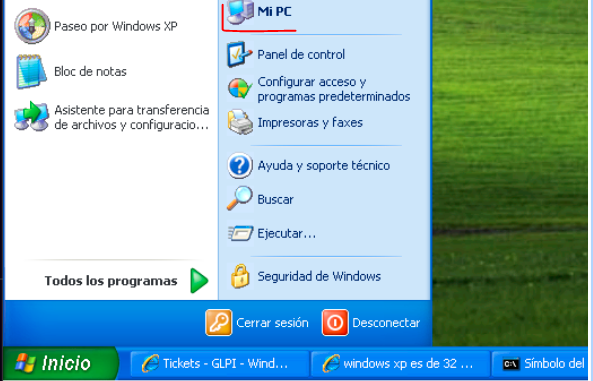

Clic en “Disco local ( C: )”

Clic en “Archivos de programa”

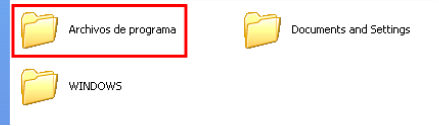

Clic en “GLPI-Agent

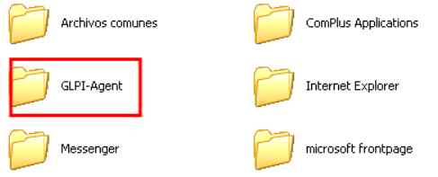

Clic en “logs”

Abrir el archivo de texto “glpi-agent”

En el archivo se abrirá el registro de instalación y conexión con el GLPI, el tiempo de espera de conexión puede variar de entre los 5 minutos a las 3 horas. 

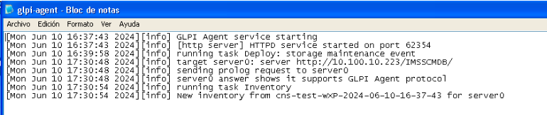

Una vez hecha la conexión con la maquina al glpi, nos debe aparecer el registro en el menú de las computadoras.

Una vez hecha la conexión con la maquina al glpi, nos debe aparecer el registro en el menú de las computadoras.

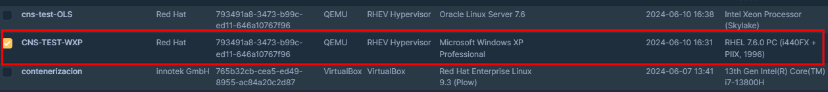

